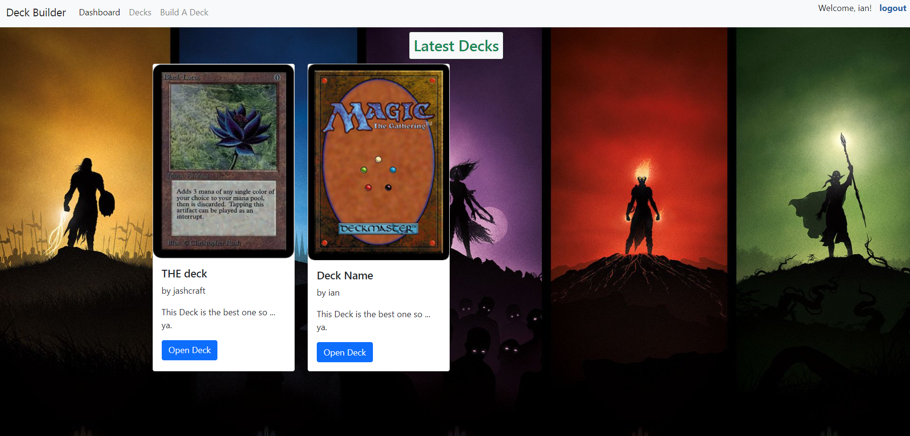
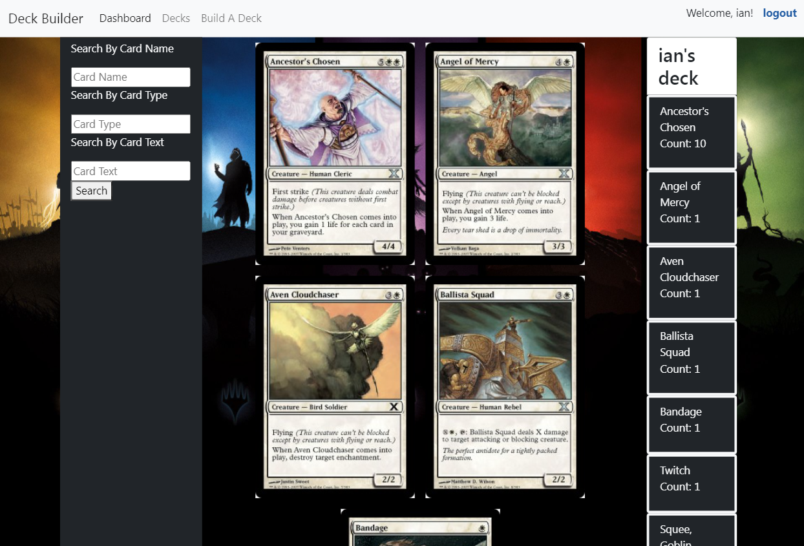

# Deck Builder

## Description

This page lets you build decks for Magic: The Gathering.

## Website

You can access the deployed website here:
 
https://moses-ian-deck-builder.herokuapp.com/

## Credits

### Creators:
* [Ian Moses](https://github.com/Moses-Ian)
* [Jonathon Ascraft](https://github.com/Jashcraft)
* [Jeffrey Koon](https://github.com/OfficialBeez)

### Technologies Used:
* [MTGSDK](https://www.npmjs.com/package/mtgsdk)
* [Bootstrap](https://getbootstrap.com/)
* [MD Bootstrap](https://mdbootstrap.com/)
* [Express](https://www.npmjs.com/package/express)

## License

Please do not copy any of our code.

## Features

Register to make new decks!
